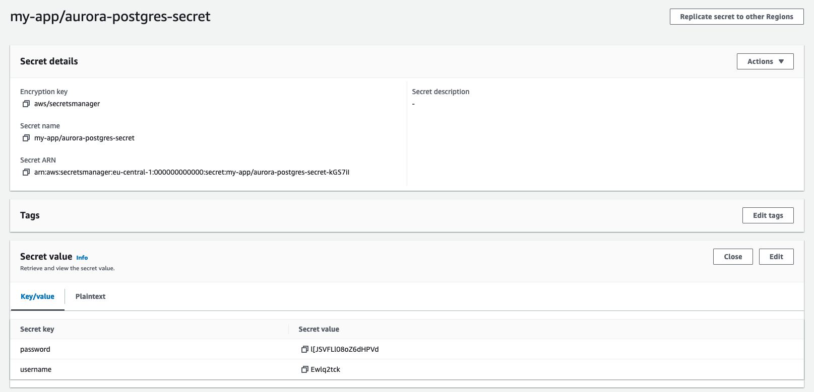

# aws-generate-secrets

A small CLI to automatically generate secrets in your AWS environment.


## Disclaimer

This tool is not developed, nor supported by Amazon Web Services, Inc (AWS).

## Description

This tool allows you to provision generated secrets to AWS Secrets Manager using
a configuration YAML like the following:

```yaml
secrets:
  - name: my-app/aurora-postgres-secret
    generator:
      username:
        length: 8
        charset: standard
      password:
        length: 18
        charset: special

profile: my-profile
```

This will result in a secure secret in AWS Secrets Manager as follows:


## Building

Only follow these steps if you intend to make changes to the code after you've cloned
this repo, otherwise skip to the "Install" section below.

### Requirements

- Go 1.19+

### Compile

```
make build
```

### Run

## Install

You can directly install the CLI by running:

```
go install github.com/swisscom/aws-generate-secrets@latest
```

## Running

```bash
export AWS_PROFILE=my-test-environment
aws-generate-secrets ./resources/examples/postgres.yaml
```

Results in:

```plain
INFO[0000] Secret created: my-app/aurora-postgres-secret (arn:aws:secretsmanager:eu-central-1:000000000000:secret:my-app/aurora-postgres-secret-kGS7iI) 
```

Or, in AWS:

